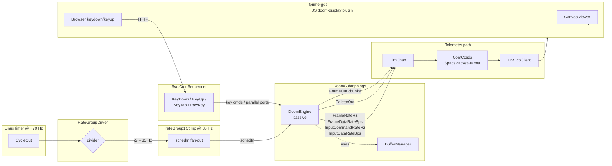

# fprime-stress

## But does it run DOOM?

Yes. Specifically, F Prime runs DOOM.

This repository is the source-of-truth for a single F Prime passive
component — `Doom::DoomEngine` — that wraps id Software's DOOM (via
the embeddable [`doomgeneric`](https://github.com/ozkl/doomgeneric)
port) inside the same component-and-port framework that flies the
[Mars helicopter](https://nasa.github.io/fprime/UsersGuide/best/ingenuity.html),
the [LCRD optical comm payload](https://www.nasa.gov/directorates/somd/space-communications-navigation-program/lcrd/),
and a long list of other JPL spacecraft. Together with the companion
deployment at
[`JPL-Devin/fprime-stress-reference`](https://github.com/JPL-Devin/fprime-stress-reference)
it produces a flight-software-shaped binary that boots, loads a WAD,
renders frames into telemetry, and accepts commands as keystrokes.

## Why this matters for embedded systems

"Can it run DOOM?" started as a joke and became a load-bearing
engineering ritual. The bar is famously low — id's 1993 game ran on a
386 with 4 MB of RAM and no GPU — and yet it exercises **almost every
non-trivial subsystem an embedded developer cares about**:

| DOOM does this | Which exercises this in flight software |
|-|-|
| Renders ~35 fps of palette-indexed frames | Sustained periodic data production |
| Streams 8-bit screen buffers + a 256-entry palette | Bulk telemetry / downlink bandwidth |
| Reads keyboard events asynchronously | Asynchronous commanding / uplink |
| Plays through demo lump on tic-by-tic logic | Deterministic rate-group execution |
| Reads its WAD through a single file API | File-system / storage abstraction |
| Uses one global zone allocator | Memory-pool discipline at init time |

If you can host DOOM, you've demonstrated periodic scheduling, bulk
telemetry, command dispatching, file I/O, and bounded memory — the
same primitives a CubeSat needs to operate. Which is exactly why
"runs DOOM" has been the embedded engineer's smoke test on Casio
watches, MIDI keyboards, Voyager-era ROMs, TI-Nspire calculators,
McDonald's POS terminals, John Deere tractors, the Touch Bar on a
2018 MacBook Pro, [a pregnancy test](https://twitter.com/Foone/status/1302820468819288066),
and — now — F Prime.

## Architecture



DOOM's frame buffer (640 × 400 palette-indexed pixels = **256 kB per
frame**) is too large to ship as a single FPP telemetry sample
under F Prime's `FW_COM_BUFFER_MAX_SIZE` limit (4 kB by default).
We chunk it: each `Doom.FrameChunk` carries five complete scan lines
(5 × 640 = 3,200 bytes of pixel data) plus a small header. Eighty
chunks per frame, 35 frames per second (DOOM's native cadence),
2,800 chunks per second of sustained downlink — every one of those
is a real F Prime message flowing through the real F Prime telemetry
pipeline.

A load-bearing observation from running this at full rate: `TlmChan`
is a slot-store — it retains only the most recent value per channel
id between Run ticks. The original implementation wrote 80 chunks
per cycle to a single channel id (`FrameOut`); only the
bottom-of-frame chunk survived to ground each Run tick and the
browser canvas accordingly only painted the HUD strip. The frame
data was real, but the per-channel sampling rate was throttled to
the Run rate by the slot store collapsing 79 of every 80 writes.

This deployment therefore multiplexes frame data across 80 distinct
telemetry channel ids (`FrameOut00` … `FrameOut79`), one per
scanline group of `ROWS_PER_CHUNK` rows. Each chunk position has
its own slot, so a single cycle produces 80 surviving samples
instead of one. A function-pointer dispatch table in
`DoomEngine::emitFrame` (invoked from `platformDrawFrame`) maps the chunk index to the
matching `tlmWrite_FrameOutNN` member function so the per-cycle
loop stays a tight `for` over the chunk count. The browser plugin
subscribes to all 80 channel ids and reassembles the full 640×400
frame as cycles arrive — the multiplex is the same pattern a real
flight payload streaming frame-rate imagery would use, and is the
proper alternative to `Svc.FileDownlink` for bulk transfer when
ground display latency matters.

## Why this is an excellent stress test

A stress test is only interesting if it exercises the system *the way
the system is meant to be exercised in flight*. This one does:

1. **Periodic, hard-real-time scheduling**. The deployment's
   `LinuxTimer` produces a ~70 Hz base cycle; `RateGroupDriver`
   divides that into a 35 Hz / 10 Hz / 1 Hz triple. DOOM lives on
   the 35 Hz group, matching its native gameplay cadence exactly.
   `DoomEngine.schedIn` is **sync** and the component is **passive**:
   the rate-group thread runs `doomgeneric_Tick` directly and the
   component owns no thread of its own. If a tick can't finish in
   its 28.6 ms budget, `RateGroupCycleSlip` fires on the same tick
   that overruns — exactly the telemetry a mission operator would
   inspect when the spacecraft is overloaded.

2. **Sustained bulk downlink**. Each rate-group tick produces 80
   serialized FPP messages of ~3.2 kB plus a palette and four rate
   channels. That is **~9 MB/s** flowing through `TlmChan` →
   `ComCcsds` → `Drv.TcpClient`. The CCSDS framer's
   `TmFrameFixedSize` is dimensioned to swallow it. Saturating the
   downlink under load is the whole point.

3. **Asynchronous uplink**. The JS GDS plugin captures browser
   keystrokes and POSTs them to the command dispatcher, which fans
   into both the regular F Prime command handlers and the parallel
   `sync input ports` (`keyTapIn` / `keyDownIn` / `keyUpIn` /
   `rawKeyIn`) — a deliberate fan-in surface so that a future
   IMU/sensor adapter could drive DOOM inputs the way a star
   tracker drives an attitude estimator. The same mutex-guarded
   key queue serves both paths.

4. **Bounded memory**. Every cross-thread buffer is a fixed-size
   member of `DoomEngine`. The component's `BufferManager` pool is
   sized at init time. The only runtime `malloc` lives inside
   doomgeneric's own zone allocator and is performed exactly once
   on `Start` — i.e. allocate-at-init followed by zero-malloc
   steady state, which is the discipline most JPL fault-tolerant
   missions impose on flight code.

5. **Measurable**. Four telemetry channels report the resulting
   workload back to the ground every second:

   | Channel | Type | Meaning |
   |-|-|-|
   | `FrameRateHz` | F32 | Frames produced per second |
   | `FrameDataRateBps` | U32 | Downlink B/s emitted as frame / palette telemetry |
   | `InputCommandRateHz` | F32 | Key events delivered per second |
   | `InputDataRateBps` | U32 | Uplink B/s arriving as key events |

   These are graphable in the GDS Channels tab and trip nicely past
   8 MB/s during gameplay. Cycle slips — when DOOM's tick exceeds the
   rate-group budget — show up directly on `rateGroup1Comp`'s
   `RgCycleSlips` channel and `RateGroupCycleSlip` event, so an
   overload is observable in the telemetry stream itself.

## Running it

```bash
# 1) Get the shareware WAD (Apache-2.0 helper, stdlib-only Python)
# 2) Build & generate the deployment first so build-artifacts/ exists
cd ../fprime-stress-reference
fprime-util generate && fprime-util build

# 3) Fetch the WAD into build-artifacts/<platform>/<dep>/data/
pip install ./lib/fprime-stress/tools/fprime-get-doom
fprime-get-doom    # auto-discovers build-artifacts/, drops doom1.wad in data/

# 4) Launch from inside the deployment bin/ dir so -w defaults work
cd build-artifacts/Linux/FprimeStressReference_ReferenceDeployment/bin
./FprimeStressReference_ReferenceDeployment -a 127.0.0.1 -p 50100 -S

# 5) (optional) install the JS GDS plugin so you can watch in a browser
cd ../../../..    # back to project root from build-artifacts/<plat>/<dep>/bin/
lib/fprime-stress/gds-plugin/install.sh
```

`-S` is a smoke-test convenience that auto-starts the engine from
`main()` so you don't need a GDS attached to issue `doom.Start`. In
normal operation a sequence or a GDS operator sends `doom.Start`.
`fprime-get-doom` and the binary's default `-w` both follow the F Prime
`build-artifacts/<platform>/<deployment>/data/` convention, so a no-arg
invocation of either works after `fprime-util build` has run.

## Contents

```
Doom/                           DoomEngine component
  Doom.fpp / DoomEngine.cpp / DoomEngine.hpp
  Commands.fppi / Telemetry.fppi / Events.fppi
  doomgeneric/                  vendored upstream DOOM source (GPLv2)
  test/ut/                      googletest unit tests
DoomSubtopology/                reusable subtopology wrapper
  DoomSubtopology.fpp
  DoomSubtopologyConfig/        per-subtopology constants
gds-plugin/                     JS-only fprime-gds addon
  doom-display/                 Vue component (canvas + key bindings)
  dashboard.xml                 Dashboard panel that hosts the addon
  install.sh                    Drops the addon into fprime-gds and
                                enables the Dashboard tab
tools/
  fprime-get-doom/              Apache-2.0 fetch-and-verify helper
THIRDPARTY/                     upstream license attribution
LICENSE                         root license (GPLv2; see Licensing)
```

## Memory & threading

Every working buffer (frame buffer, palette, key queue, argv) is a
fixed-size member of the `DoomEngine` instance. Nothing in the F Prime
glue calls `malloc` after init. doomgeneric's own `Z_Init` arena is
allocated exactly once from inside upstream code we deliberately do
not modify; the F Prime glue itself is malloc-free in steady state.

The DoomEngine is a **passive component** — it owns no thread of
its own — and `schedIn` is **sync**: each rate-group tick runs DOOM inline on the
`rateGroup1Comp` thread. A tick that overruns its budget therefore
trips `RateGroupCycleSlip` immediately rather than silently being
absorbed by a queue — which is the discipline you want from a
flight-software rate group.

## Pacing model

The engine runs in upstream doomgeneric's `singletics` mode: exactly
one game tic is built and run per `schedIn` cycle, with no wall-clock
coupling — the rate group is the sole pacing authority. `DG_SleepMs`
never blocks; it advances a virtual clock that `DG_GetTicksMs` adds to
real elapsed time, so in-engine sleep/poll loops (notably the
screen-wipe melt) complete without stalling the rate-group thread.
When one tic draws multiple frames (a melt), the first frame is
emitted live and the rest are captured into a bounded ring buffer
(`MELT_QUEUE_CAPACITY` frames) that `schedIn_handler` plays back one
frame per cycle, so the melt animates on the downlink at its native
pace. Frames that overflow the buffer are dropped and counted in the
`FramesDropped` channel.

## Licensing

* Upstream doomgeneric is vendored under `Doom/doomgeneric/` verbatim
  and is GPLv2 (`Doom/doomgeneric/COPYING`).
* The new F Prime glue (DoomEngine, DoomSubtopology, GDS plugin) is
  GPLv2 because the final linked binary inherits GPLv2.
* The `fprime-get-doom` helper is Apache-2.0 (no DOOM code links into
  the helper).
* The F Prime framework itself is unmodified Apache-2.0.

The shareware DOOM1.WAD is *not* committed to this repo — see
`tools/fprime-get-doom/README.md` for the rationale and the SHA-256
pin used to verify mirror downloads.

## Scientific, and fun

The first time a frame of DOOM rendered out of an F Prime telemetry
channel was, scientifically speaking, an enormous proof that F Prime
is the right shape of framework for hard-real-time embedded software.
Pacing the rate group at 35 Hz, packing the frame buffer into 80
`FrameChunk` samples a frame, holding ~8 MB/s of sustained downlink
through the CCSDS framer, and round-tripping keystrokes from a
browser through the command dispatcher to the engine — none of it
needed any framework changes. F Prime just *did* it.

It was also, scientifically speaking, an enormous amount of fun.

**If it runs F Prime, it runs DOOM.**
